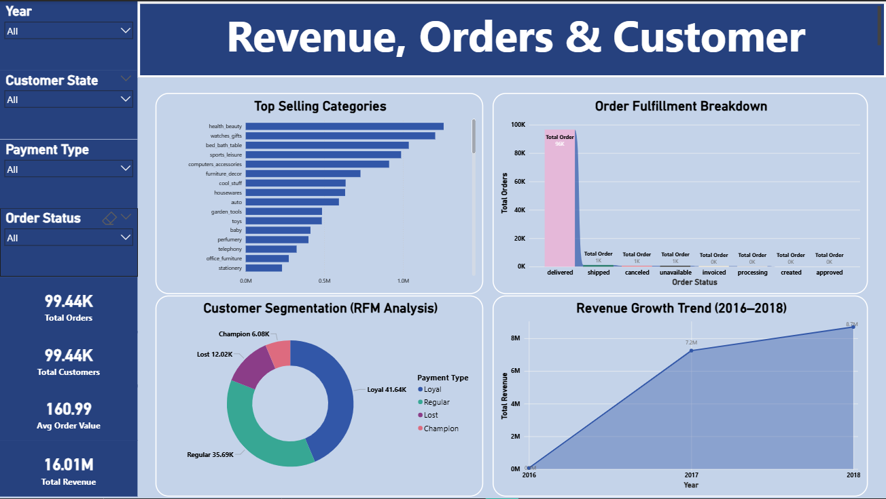
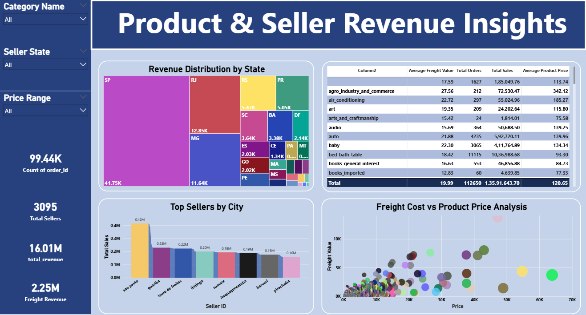

# 📊 AI-Powered E-Commerce Business Intelligence System

An end-to-end Business Intelligence system combining SQL analytics, RFM customer segmentation, and a natural language query engine built with Streamlit. Transforms raw e-commerce data into executive-level insights — no SQL required.

---

## 🚀 Overview

This project analyzes a large-scale Brazilian e-commerce dataset to surface actionable business intelligence across revenue, operations, customer behavior, and geography. It pairs traditional data analysis with a lightweight AI intent engine to simulate a conversational BI assistant.

**Dataset:** [Olist Brazilian E-Commerce](https://www.kaggle.com/datasets/olistbr/brazilian-ecommerce)

https://github.com/user-attachments/assets/55694efa-13f4-4f9e-995c-e7a016221fec

---

## 🧠 AI Query Engine

Ask business questions in plain English — no SQL needed.

**Example queries:**
- `"Total revenue"`
- `"Top 5 states by revenue"`
- `"Revenue by customer segment"`
- `"Orders by payment type"`
- `"Average order value"`

**How it works:**

| Step | Component | What it does |
|------|-----------|--------------|
| 1 | `ai_query_engine.py` | Parses intent — extracts metric, dimension, aggregation type, and Top-N conditions |
| 2 | `analytics_engine.py` | Executes aggregation, grouping, and sorting via Pandas |
| 3 | `ai_explainer.py` | Generates human-readable insights and highlights key patterns |

---

## 📊 Key Metrics

| Metric | Value |
|--------|-------|
| Customers | 96,000+ |
| Orders | 99,000+ |
| Total Revenue | R$15.8M |
| Delivery Success Rate | 97% |

**Headline findings:**
- Revenue scaled consistently from 2016–2018
- Mass-market model with low average order value
- Revenue heavily concentrated in São Paulo
- Strong delivery reliability, but slow delivery speed
- Majority of customers purchase only once

---

## 👥 RFM Customer Segmentation

Customers are scored on **Recency**, **Frequency**, and **Monetary** value and grouped into four segments:

| Segment | Description |
|---------|-------------|
| Champion | Recent, frequent, high-spend |
| Loyal | Consistent buyers, strong LTV |
| Regular | Moderate engagement |
| Lost | Inactive, low engagement |

**Key finding:** Loyal customers drive the majority of revenue, yet most customers purchase only once — making retention the single largest growth lever.

---

## ✅ Supported Capabilities

- Revenue, order count, and AOV aggregation
- Group-by analysis (state, category, payment type)
- Top-N queries
- AI-generated result explanations
- Modular, extensible backend architecture

## ❌ Current Limitations

- No month/year-based filtering (e.g. "Monthly revenue in 2018")
- No time-series trend detection or YoY comparisons
- No multi-condition queries
- Rule-based intent engine — not an LLM

---

## 📊 Power BI Dashboard Preview

> Full interactive dashboard built in Power BI covering RFM segmentation, revenue trends, payment methods, and geographic distribution.

<p align="center">
  
  &nbsp;&nbsp;
  
</p>

> 💡 To explore the full dashboard, open `powerbi/E_Commerce_Dashboard.pbix` in Power BI Desktop.

---

## 🛠 Tech Stack

`Python` · `Pandas` · `NumPy` · `Matplotlib` · `Streamlit` · `SQL` · `Power BI`

---

## 📁 Project Structure

```
├── app/
│   ├── __init__.py
│   ├── ai_explainer.py          # Result narration & business insights
│   ├── ai_query_engine.py       # Intent parsing
│   ├── analytics_engine.py      # Aggregation & query execution
│   ├── app.py                   # Streamlit interface
│   ├── data_loader.py           # Data ingestion
│   ├── feature_engineering.py   # RFM scoring & feature prep
│   ├── safe_executor.py         # Query safety layer
│   └── utils.py                 # Helper functions
├── data/
│   ├── olist_customers_dataset.csv
│   ├── olist_order_items_dataset.csv
│   ├── olist_order_payments_dataset.csv
│   ├── olist_orders_dataset.csv
│   ├── olist_products_dataset.csv
│   ├── olist_sellers_dataset.csv
│   └── product_category_name_translation.csv
├── media/
│   └── Working_video.mp4
│   └── Dashboard1.png
│   └── Dashboard2.png
├── notebooks/
│   ├── Olist_RFM_Customer_Segmentation.ipynb
│   └── olist_business_performance_analysis.ipynb
├── powerbi/
│   └── E_Commerce_RFM.pbix
├── reports/
│   └── Project_Report.pdf
├── .gitignore
├── LICENSE
├── README.md
└── requirements.txt
```

---

## 🚀 Getting Started

```bash
git clone https://github.com/your-username/your-repo.git
cd your-repo
pip install -r requirements.txt
streamlit run app.py
```
